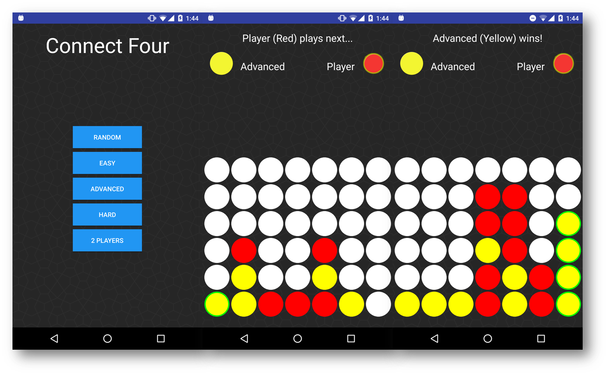

# Connect Four Game with Multiplayer
 

Connect Four Open Source Android Game.

In my implementation of Connect Four you can play against AI players with different difficulty levels.
You can also play against your real friend. 

## Future plans
* New design

## Used technologies
* Google Play Games Real-Time Multiplayer with achievements.
* Bitmaps, Canvas.
* Different Activities, Event Listeners.

## Inspiration for the project
Some ideas were taken from the Udacity Course [Intro to Java](https://www.udacity.com/course/intro-to-java-programming--cs046).

License
-------

	The MIT License (MIT)

	Copyright (c) 2016 Dmytro Karataiev

	Permission is hereby granted, free of charge, to any person obtaining a copy
	of this software and associated documentation files (the "Software"), to deal
	in the Software without restriction, including without limitation the rights
	to use, copy, modify, merge, publish, distribute, sublicense, and/or sell
	copies of the Software, and to permit persons to whom the Software is
	furnished to do so, subject to the following conditions:

	The above copyright notice and this permission notice shall be included in all
	copies or substantial portions of the Software.

	THE SOFTWARE IS PROVIDED "AS IS", WITHOUT WARRANTY OF ANY KIND, EXPRESS OR
	IMPLIED, INCLUDING BUT NOT LIMITED TO THE WARRANTIES OF MERCHANTABILITY,
	FITNESS FOR A PARTICULAR PURPOSE AND NONINFRINGEMENT. IN NO EVENT SHALL THE
	AUTHORS OR COPYRIGHT HOLDERS BE LIABLE FOR ANY CLAIM, DAMAGES OR OTHER
	LIABILITY, WHETHER IN AN ACTION OF CONTRACT, TORT OR OTHERWISE, ARISING FROM,
	OUT OF OR IN CONNECTION WITH THE SOFTWARE OR THE USE OR OTHER DEALINGS IN THE
	SOFTWARE.